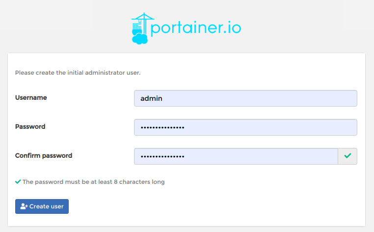
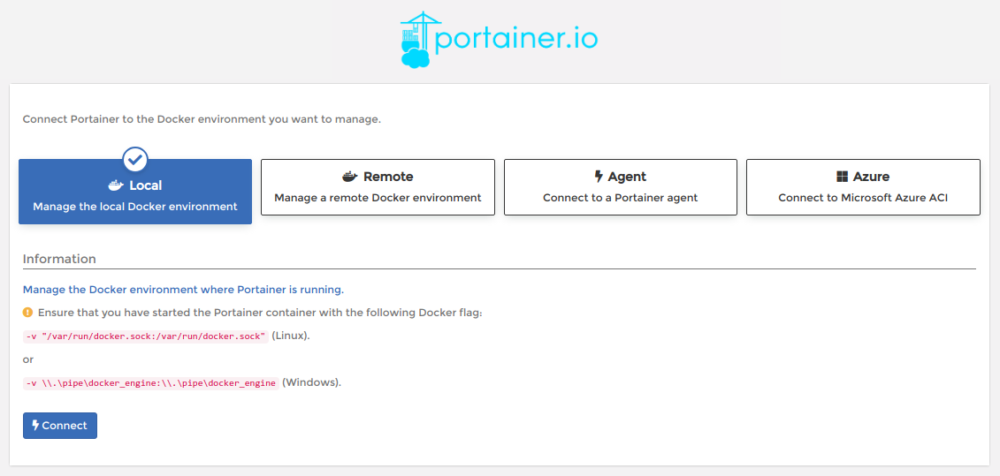
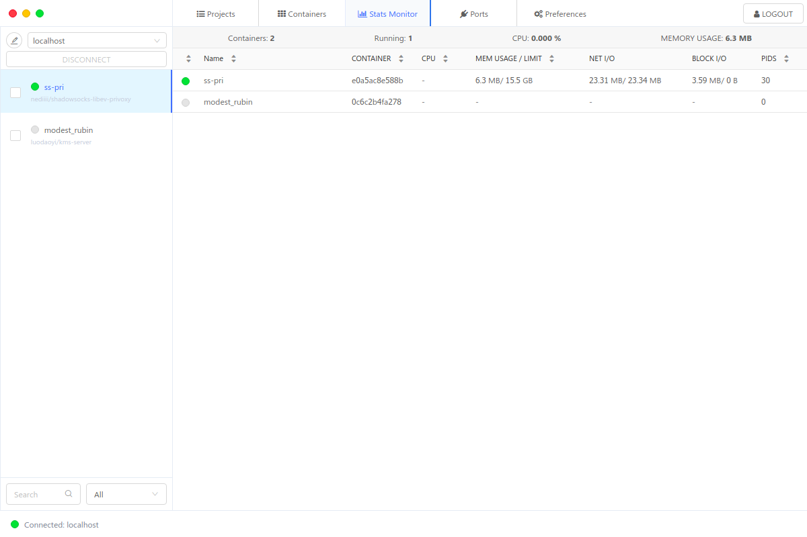

# 用 portainer 优雅管理 docker 容器

[^_^]: # (url:docker-gui-app)
[^_^]: # (tag:docker,#tech)
[^_^]: # (excerpt:厌倦了命令行？这里有漂亮的 GUI 应用助你管理 Docker)

> 笔者自从接触了 Docker 后就深深沉迷于它，然当跑的应用多了，众多的容器难免眼花缭乱。便去搜寻相关的解决方案，在此将信息整合分享。  
> 如果你也厌倦了命令行，希望尝试一下 GUI 应用，那么这篇文章值得一看。

## 主流的 Docker ui

- [Portainer](https://www.portainer.io)
- [Kitematic](https://kitematic.com/)
- [DockStation](https://dockstation.io/)

_你可能会奇怪为什么`Shipyard`没有在列表上，这里明确告诉你，`Shipyard`项目已经停止开发，所以笔者将其移除了_

## 对比

| 功能                | DockerStation | Kitematic    | Portainer |
| ------------------- | ------------- | ------------ | --------- |
| 平台支持            | 全平台        | 不支持 linux | 全平台    |
| Docker Compose 支持 | +             | -            | -         |
| Docker Machine 支持 | +             | +            | +         |
| 任意容器配置        | -             | +            | +         |
| 容器启动/停止/重启  | +             | +            | +         |
| 查看容器日志        | +             | +            | +         |
| 日志全文搜索        | +             | -            | -         |
| 容器分组和搜索      | +             | -            | -         |
| 资源监控            | +             | -            | +         |
| 远程节点支持        | +             | -            | +         |
| 应用模板            | -             | -            | +         |
| 自定义 hubs         | -             | -            | +         |

## Portainer 安装

> 详情参阅[https://www.portainer.io/installation/](https://www.portainer.io/installation/)

因`Portainer`是个 Web 应用，其自然可以轻松以`docker`方式运行。  
linux 下执行下列命令（其他平台请查看官方文档，在此不赘述）：

```bash
# 新建 volume
docker volume create portainer_data
# 运行容器
docker run -d -p 9000:9000 \
-v /var/run/docker.sock:/var/run/docker.sock \
-v portainer_data:/data \
portainer/portainer
```

## Portainer 使用

如`Portainer`在本地运行，则登录 [localhost:9000](localhost:9000) 即可访问`Portainer`应用，否则请输入对应的`ip:port`访问，笔者将其运行在本地做演示。

### 注册

登录[localhost:9000](localhost:9000)后，会跳转到初始化页面，要求您创建一个管理员账号，如图：



填写好账号信息后，点击左下角创建用户（Create user)，注册工作就完成了。

### 连接

注册账号之后进入Docker环境选择界面，选中远端环境（Remote）还需要填写额外的地址和认证信息，这里笔者选择本地环境（`Local`）做演示（此选项后期可修改，亦可添加多个Docker，在此不需要过多纠结），如图：


### 主界面

成功连接Docker之后便进入到应用的主界面了，展示了关于Docker的概览信息，如图：


更多功能诸如多用户，多端点，多注册器等功能就等读者自己去体验了。

## DockStation 安装

> 详情参阅[https://dockstation.io/](https://dockstation.io/)

与`Portainer`不同，`DockStation`是一个GUI应用，也就不太适合用`Docker`来运行。  
这里采用的安装其应用包的方式将其当成一个应用运行在宿主机上。
如笔者的`ubuntu18`，只需下载对应的[deb包](https://github.com/DockStation/dockstation/releases/download/v1.5.0/dockstation_1.5.0_amd64.deb)，然后安装即可。

## DockStation 使用

如图所示，应用UI风格偏MAC，功能不算复杂，熟悉`Docker`的用户很容易能理解它。有兴趣的朋友可以入手玩一玩。


