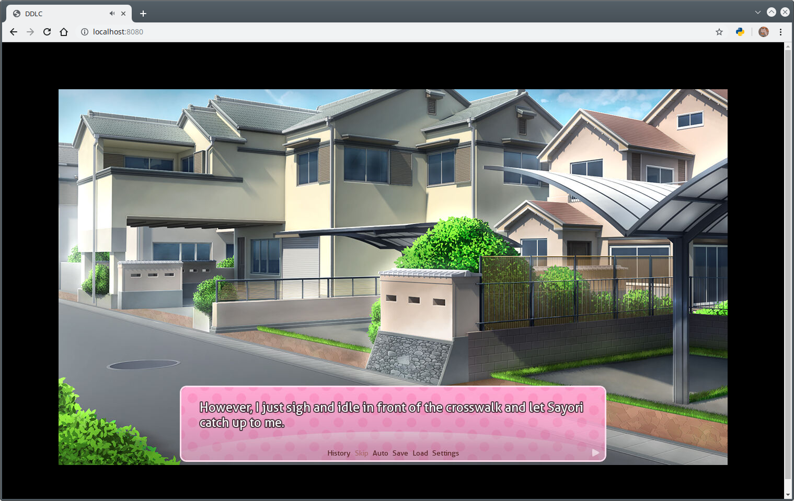

# Dockerize GUI app

[^_^]: # (url:dockerize-gui-app)
[^_^]: # (tag:docker,#tech)
[^_^]: # (excerpt:dockerize typical GUI app so that you can visit it in browser)

**This project dockerize typical GUI app so that you can visit it in browser.**
**It made up with open source project, just need a little code work to bind them together.**

## Two Main problems

### How to interact

1. bundle `xvfb` and a VNC server in container

2. share the host's X11 socket with container as an external volume

I choose the `xvfb` one because I don't want to share the host's socket

### How to transfer the audio/sound

1. capture the audio and transfer it to the browser.

2. share the host's sound card with container so that the audio can play on host's device.

I choose the first solution because I don't want to share the host's snd card too . By the way, server typically has no sound card.

## Interact sulotion

### Tech

- xvfb
- VNC
- NoVNC
- Websocketify

### Why not Xpra

I have test `Xpra` three times more , but it truns out that it has a very bad latency and rendering problem.And I didn't find out why, maybe it's because the game I test not fit it, or maybe i did't set the envrioment right. Final I try VNC solution ,and it work just fine except audio.

### xvfb

`Xvfb` or X virtual framebuffer is a display server implementing the X11 display server protocol. In contrast to other display servers, Xvfb performs all graphical operations in virtual memory without showing any screen output.

In Docker container , there is no screen output device , and all the GUI app render need a output displayer, the `xvfb` can content it.

### NoVNC

NoVNC can access `vnc server` from browser , and I just want the docker container work along with that way.

It need server support `websocket` , and the sub project `Websocketify` can handle it.

## Audio transfer sulotion

- GStreamer
- WebRTC
- Janus WebRTC Server
- Pulseaudio

### Why WebRTC

`WebRTC` is a free, open-source project that provides web browsers and mobile applications with real-time communication via simple application programming interfaces.The `WebRTC` initiative is a project supported by `Google`, `Mozilla` and `Opera`, amongst others.

If we choose to bind the host's snd card, it can only play sound on host's device, which mean that we can not hear the sound if I'm not visit the service on the host.That's why i give up the snd card map solution.

Typicaly vnc solution has no audio support , for example noVNC. It did not transfer the audio,unless we do some other work to implement it. And there is a tech call `WebRTC` just suitable for the audio transfer.

### GStreamer

`GStreamer` is a pipeline-based multimedia framework that links together a wide variety of media processing systems to complete complex workflows.

In my solution , I use `GStreamer` to capture the audio and convert it to the proper type , which is `opus` in here. It's very powerful and I nearly write no code to achieve this goal.

### Pulseaudio

`PulseAudio` is a sound system for POSIX OSes, meaning that it is a proxy for your sound applications. It allows you to do advanced operations on your sound data as it passes between your application and your hardware. Things like transferring the audio to a different machine, changing the sample format or channel count and mixing several sounds into one are easily achieved using a sound server.

`PulseAudio` to create the sink for app , so that `GStreamer` can get the audio stream from `pulseaudio`.

## Details

### base image

Since we have lots of software to run. Choosing a mature Linux distro is reasonable. So I use the ubuntu as my base image.

First , modify it to be more suitable for use in mainland China.

`the nediiii/ubuntu:18.04 Dockerfile`

```dockerfile
FROM ubuntu:18.04 as builder

LABEL maintainer "nediiii varndiiii@gmail.com"

RUN sed -i 's/archive.ubuntu.com/mirrors.tuna.tsinghua.edu.cn/g' /etc/apt/sources.list && \
    sed -i 's/security.ubuntu.com/mirrors.tuna.tsinghua.edu.cn/g' /etc/apt/sources.list

ENV TZ Asia/Shanghai

RUN apt-get update && \
    apt-get install -y tzdata && \
    ln -snf /usr/share/zoneinfo/$TZ /etc/localtime && \
    echo $TZ > /etc/timezone

# -----------------------------------------------------------------------------------

FROM ubuntu:18.04

LABEL maintainer="nediiii <varnediiii@gmail.com>"

RUN sed -i 's/archive.ubuntu.com/mirrors.tuna.tsinghua.edu.cn/g' /etc/apt/sources.list && \
    sed -i 's/security.ubuntu.com/mirrors.tuna.tsinghua.edu.cn/g' /etc/apt/sources.list

# copy timezone file to set time and timezone
COPY --from=builder /etc/localtime /etc/timezone /etc/

# CMD ["/bin/bash"]

# docker build . --no-cache -t nediiii/ubuntu:18.04
```

### Janus image

Second , install janus ( because it's the most hard part to deal with ). As the offical doc mentioned, it could not just use the ubuntu apt-get to install it's dependences. Further more, I think the docs just has something wrong with `libsrtp` package. The docs say it should add `--libdir=/usr/lib64` flag for x64 arch, but I went wrong if I did so. And if I just ignore this suggestion , everything work fine. I spend three days on it , what a terrible experience.

`the nediiii/janus Dockerfile`

```dockerfile
FROM nediiii/ubuntu:18.04

LABEL maintainer "nediiii varndiiii@gmail.com"

RUN apt-get update && \
    apt-get install -y \
    libmicrohttpd-dev \
    libjansson-dev \
    libssl-dev \
    libsofia-sip-ua-dev \
    libglib2.0-dev \
    libopus-dev \
    libogg-dev \
    libcurl4-openssl-dev \
    liblua5.3-dev \
    libconfig-dev \
    pkg-config \
    gengetopt \
    libtool \
    automake \
    cmake \
    gtk-doc-tools \
    wget \
    && \
    # libnice
    cd /tmp && \
    wget https://github.com/libnice/libnice/archive/0.1.16.tar.gz && \
    tar -zxvf 0.1.16.tar.gz && \
    cd /tmp/libnice-0.1.16 && \
    ./autogen.sh && \
    ./configure --prefix=/usr && \
    make && make install \
    && \
    # libsrtp
    cd /tmp && \
    wget https://github.com/cisco/libsrtp/archive/v2.2.0.tar.gz && \
    tar -zxvf v2.2.0.tar.gz && \
    cd /tmp/libsrtp-2.2.0 && \
    ./configure --prefix=/usr --enable-openssl && \
    make shared_library && make install \
    && \
    # libwebsocket
    cd /tmp && \
    wget https://github.com/warmcat/libwebsockets/archive/v3.1.0.tar.gz && \
    tar -zxvf v3.1.0.tar.gz && \
    cd /tmp/libwebsockets-3.1.0 && \
    mkdir build && \
    cd build && \
    cmake -DLWS_MAX_SMP=1 -DCMAKE_INSTALL_PREFIX:PATH=/usr -DCMAKE_C_FLAGS="-fpic" .. && \
    make && make install \
    && \
    # janus
    cd /tmp && \
    wget https://github.com/meetecho/janus-gateway/archive/v0.7.1.tar.gz && \
    tar -zxvf v0.7.1.tar.gz && \
    cd /tmp/janus-gateway-0.7.1 && \
    ./autogen.sh && \
    ./configure --prefix=/opt/janus --disable-data-channels --disable-rabbitmq --disable-mqtt && \
    make && make install && make configs \
    && \
    rm -rf /tmp/* /var/lib/apt/lists/*

# docker build . --no-cache -t nediiii/janus
```

### Install GStreamer

I install it but comment two line which I do not need. If you uncomment it , it will install a old version package which will cause a conflict with `janus`. I also spend lots of time to slove it out.

`Dockerfile`

```dockerfile
FROM nediiii/janus

LABEL maintainer "nediiii varndiiii@gmail.com"

# gstreamer1.0-plugins-bad need libsrtp ,which is no compatible with janus webrtc server
RUN apt-get update && \
    apt-get install -y --no-install-recommends \
    libgstreamer1.0-0 \
    gstreamer1.0-plugins-base \
    gstreamer1.0-plugins-good \
    # gstreamer1.0-plugins-bad \
    # gstreamer1.0-plugins-ugly \
    gstreamer1.0-libav \
    gstreamer1.0-doc \
    gstreamer1.0-tools \
    gstreamer1.0-x \
    gstreamer1.0-alsa \
    gstreamer1.0-gl \
    gstreamer1.0-gtk3 \
    gstreamer1.0-qt5 \
    gstreamer1.0-pulseaudio

# docker build . --no-cache -t nediiii/janus-gstreamer
```

### Bundle all the software

Now , it's time to bundle all these out. I change some code to make it suitable to be a `novnc` container.

the `supervisord` manage all the process , and now it can access via browser and you can see a `xterm` app running. The whole file you can find it in my [github repos](https://github.com/nediiii/ubuntu-base-docker-image/tree/master/novnc-container) .

1. modify the `index.html` for `novnc`

   add janus.js and necessary files to it.

2. modify the `janus.plugin.streaming.jcfg` 

   delete the video stream so that the server only transfer the audio to browser

3. set up the `supervisord.conf`

   ```conf
   [supervisord]
   nodaemon=true
   
   [program:xvfb]
   priority=1
   command=Xvfb :0 -screen 0 "%(ENV_DISPLAY_WIDTH)s"x"%(ENV_DISPLAY_HEIGHT)s"x24
   autostart=true
   autorestart=true
   
   [program:x11vnc]
   priority=10
   command=/usr/bin/x11vnc
   autorestart=true
   
   [program:pulseaudio]
   priority=10
   command=pulseaudio
   
   [program:janus]
   priority=20
   command=/opt/janus/bin/janus
   autorestart=true
   
   [program:novnc]
   priority=20
   command=/root/noVNC/utils/launch.sh --vnc localhost:5900 --listen 8080
   autorestart=true
   
   [program:gstreamer]
   priority=20
   command=gst-launch-1.0 -v -e pulsesrc ! audioconvert ! audioresample ! audio/x-raw,channels=1,rate=16000 ! opusenc bitrate=20000 ! rtpopuspay ! udpsink host=127.0.0.1 port=5002
   autorestart=true
   
   [program:app]
   priority=30
   command=xterm
   autorestart=true
   ```

The `novnc-continaer` Dockerfile :
```dockerfile
FROM nediiii/janus-gstreamer

LABEL maintainer "nediiii varndiiii@gmail.com"

# Setup demo environment variables
ENV DISPLAY=:0.0 \
    DISPLAY_WIDTH=1440 \
    DISPLAY_HEIGHT=900

# Install git, supervisor, VNC, & X11 packages
RUN apt-get update && \
    apt-get install -y \
    supervisor \
    xvfb \
    x11vnc \
    pulseaudio \
    xterm

RUN wget https://github.com/novnc/noVNC/archive/v1.1.0.tar.gz && \
    tar -zxvf v1.1.0.tar.gz && \
    rm v1.1.0.tar.gz && \
    mv noVNC-1.1.0 /root/noVNC && \
    wget https://github.com/novnc/websockify/archive/v0.8.0.tar.gz && \
    tar -zxvf v0.8.0.tar.gz && \
    rm v0.8.0.tar.gz && \
    mv websockify-0.8.0 /root/noVNC/utils/websockify

COPY noVNC/index.html noVNC/streamingtest.js noVNC/janus.js /root/noVNC/
COPY noVNC/core/rfb.js /root/noVNC/core/rfb.js
COPY janus/janus.plugin.streaming.jcfg /opt/janus/etc/janus/janus.plugin.streaming.jcfg

COPY supervisord.conf /etc/supervisor/conf.d/supervisord.conf

# Modify the launch script 'ps -p'
# RUN sed -i -- "s/ps -p/ps -o pid | grep/g" /root/noVNC/utils/launch.sh

EXPOSE 8080 8088

CMD ["/usr/bin/supervisord", "-c", "/etc/supervisor/conf.d/supervisord.conf"]

# docker build . --no-cache -t nediiii/novnc-continaer
# docker run --rm -d -p 8080:8080 -p 8088:8088 nediiii/novnc-continaer
```

### Add the game or app

The main propose it to visit a game from a browser. And for now, I achieve it but not as perfect as I image.

With a game, I choose [ddlc](https://ddlc.moe/) , the github no recommend file over 50M, and limit file not over 100M , so I just put the DDLC game to the gitlab.

```dockerfile
FROM nediiii/novnc-continaer

LABEL maintainer "nediiii varndiiii@gmail.com"

RUN wget https://gitlab.com/nediiii/file-store/raw/master/DDLC-1.1.1-pc.tar.gz && \
    tar -zxvf DDLC-1.1.1-pc.tar.gz && rm DDLC-1.1.1-pc.tar.gz && \
    mv DDLC-1.1.1-pc /app/

# EXPOSE 8080 8088
RUN sed -i 's/xterm/app\/DDLC-1.1.1-pc\/DDLC.sh/g' /etc/supervisor/conf.d/supervisord.conf

# docker build . --no-cache -t nediiii/ddlc
# docker run --rm -d -p 8080:8080 -p 8088:8088 nediiii/ddlc
```

## Run this demo on your own

1. make sure you have installed the latest stable version of Docker

2. pull the image

   `docker pull nediiii/ddlc`

3. run the container

   `docker run --rm -d -p 8080:8080 -p 8088:8088 nediiii/ddlc`

4. visit on your browser

   [localhost:8080](localhost:8080)

Here are screenshots :




## Extend this container on your own

Let's extend this image to run other GUI app, eg. firefox.

1. get the firefox

2. modify the supervisord conf

here's the Dockerfile for it:

```dockerfile
FROM nediiii/novnc-continaer

LABEL maintainer "nediiii varndiiii@gmail.com"

RUN apt-get update && \
    apt-get install -y \
    firefox \
    ffmpeg \
    fonts-noto \
    fonts-noto-cjk \
    fonts-noto-color-emoji \
    --no-install-recommends \
    && rm -rf /var/lib/apt/lists/*

# EXPOSE 8080 8088
RUN sed -i 's/xterm/firefox/g' /etc/supervisor/conf.d/supervisord.conf

# docker build . --no-cache -t nediiii/firefox
# docker run --rm -d -p 8080:8080 -p 8088:8088 nediiii/firefox
```

Then , we build this image.

`docker build . --no-cache -t nediiii/firefox`

At last, we run it .

`docker run --rm -d -p 8080:8080 -p 8088:8088 nediiii/firefox`

Now, you can visit [localhost:8080](localhost:8080) to check it.


## Ref

<https://github.com/novnc/noVNC>
<http://www.karlrunge.com/x11vnc/>
<https://github.com/novnc/websockify>
<https://webrtc.org/>
<https://gstreamer.freedesktop.org/>
<https://www.freedesktop.org/wiki/Software/PulseAudio/>
https://github.com/meetecho/janus-gateway
https://medium.com/@pigiuz/hw-accelerated-gui-apps-on-docker-7fd424fe813e
https://hub.docker.com/r/babim/ubuntu-novnc/dockerfile
https://github.com/epfl-sti/octave-x11-novnc-docker
https://github.com/psharkey/docker/tree/master/novnc
