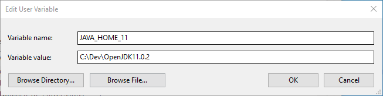

# Windows 环境 JDK 配置

[^_^]: # (url:jdk-windows-setup)
[^_^]: # (tag:note,setup,jdk,java,windows,#tech)
[^_^]: # (excerpt:Windows 下配置多版本 JDK 环境)

> Tested Environment  
> Operating System: Microsoft Windows Version 1903 (OS Build 18865.1000)  
> 谨以此文献给笔者活在虚拟机里的 Windows

## 概览

`JDK`的设置主要有两点：

- 下载正确的版本
  - 对应平台（Windows/Linux）
  - 对应架构（64bit/32bit）
  - 对应需求版本（1.8/11）
- 配置正确的环境变量
  - JAVA_HOME
  - Path

## 下载 JDK

建议同时下载`JDK8`和`JDK11`，无特殊需求建议使用`OpenJDK`，建议下载压缩包格式的（非`exe`或`msi`后缀）  
为方便读者查阅，以下几个网址是笔者推荐的`JDK`获取途径：

- [Oracle JDK](https://www.oracle.com/technetwork/es/java/javasebusiness/downloads/index.html)
- [OpenJDK](https://openjdk.java.net/)
- [ojdkbuild](https://github.com/ojdkbuild/ojdkbuild)

笔者使用的是 ojdkbuild 提供的 JDK，直接到[ojdkbuild](https://github.com/ojdkbuild/ojdkbuild)下载对应平台和版本的`JDK`，不再赘述。


## 解压 JDK

1. 在`c盘`新建`Dev`文件夹，将下载的`JDK`解压到该文件夹下
2. 随后删除空层文件夹并更改`JDK`文件夹的名字，使其简短些
3. 注意文件夹层次结构（注意第二步的提示），理想情况下应该有如图所示有效路径：

   

## 设置环境变量

为了后续的脚本切换`JDK`,此处使用的是用户环境变量，*非*系统环境变量，如非特殊说明，环境变量一律指代用户环境变量

1. 新建 `JAVA_HOME_{version}` 变量,其中 version 为 JDK 版本,有多少个版本的 JDK 就建立多少个对应的环境变量,环境变量的值分别为对应的`JDK`的路径  
   例如: 本人使用两个版本的`JDK`,分别是 JDK8 和 11,则新建两个环境变量,分别是

   | Variable     | Value                     |
   | ------------ | ------------------------- |
   | JAVA_HOME_8  | C:\Dev\Java\OpenJDK1.8.0  |
   | JAVA_HOME_11 | C:\Dev\Java\OpenJDK11.0.2 |

   
   

2. 新建 `JAVA_HOME` 变量,其值为上一步所新建的变量,格式为`%`包裹,见示例:

   | Variable  | Value         |
   | --------- | ------------- |
   | JAVA_HOME | %JAVA_HOME_8% |

   

3. `Path`变量中新增一条记录,设置为`%JAVA_HOME%\bin`

   

## 检查配置是否成功

命令行运行`java -version`，应该输出`Java`的版本信息


## 编写版本切换脚本

如需更改当前使用的`Java`版本，可以手动更改`JAVA_HOME`的变量值。如果更改`Java`版本的频次高，可以使用脚本来简化这一操作。  
笔者技拙，尝试过使用`bat脚本`更改系统环境变量，但这样脚本就需要管理员权限，且无法保证`JDK`的切换效果，遂更换思路，设置用户环境变量来达成目的。  
下列脚本一律不需要管理员权限，且只更改用户环境变量，在`Windows 10,v1903`测试通过。如果你的`Java`环境变量跟上文提到的设置方式一致，那么应该可以直接使用下面脚本。
新建一个文件夹，如`C:\Scripts`，然后在该文件夹下新建这三个文件：

1. 主脚本 `jdk_switch.bat`
2. 切换脚本 `switch_to_openjdk_8.bat`
3. 切换脚本 `switch_to_openjdk_11.bat`


### 主脚本 jdk_switch.bat

```batch
@echo off

:start
echo current JDK version:
java -version

echo.
echo =============================================
echo available JDK version:
echo OpenJDK-8
echo OpenJDK-11
echo =============================================

:select
set /p opt=please choose JDK version ( 8 or 11 )：
if %opt%==8 (
    set TARGET_JAVA_HOME=%%JAVA_HOME_8%%
    echo current JDK version:
    %JAVA_HOME_8%\bin\java -version
)^
else if %opt%==11 (
    set TARGET_JAVA_HOME=%%JAVA_HOME_11%%
    echo current JDK version:
    %JAVA_HOME_11%\bin\java -version
)^
else (
    echo illegal input, please re-enter
    goto select
)

echo =============================================
SETX JAVA_HOME "%TARGET_JAVA_HOME%"

pause
:end
@echo on
```

### 切换脚本 switch_to_openjdk_8.bat

```batch
SETX JAVA_HOME "%%JAVA_HOME_8%%"
```

### 切换脚本 switch_to_openjdk_11.bat

```batch
SETX JAVA_HOME "%%JAVA_HOME_11%%"
```

### 脚本效果

运行脚本的效果如图所示：


### 添加环境变量

为了在命令行中能够直接使用脚本，需要把脚本目录添加进 Path 变量里。过程不再赘述。如图：


此后可在命令行中直接运行脚本：


### 设置索引

为了使用 Windows 搜索时能直接搜索到脚本，需要把脚本目录添加进索引目录里。
要进入`索引设置`，有两个方式（下列第 1 步和第 2 步最终效果相同，皆是为了进入第 3 步）

1. 按`Windows键`然后键入`change how windows`，如图所示，点击图中标示的选项（如有问题，可从第 2 步开始）：

   

2. 从`设置`->`搜索`里进入，如图：

   
   

3. 进入到了索引设置，点击修改，如图：

   

4. 勾选上脚本目录后保存，如图：

   

5. 测试索引效果，`Windows`能直接搜索到脚本

   

## 结语

此篇笔记主要目的是留个记录，为了以后遇到 JDK 的配置能够有个自己的参考，也为了将自己的一些思考和经验分享出去。  
笔者写的东西还少，实在难以把握内容的深浅度，写详细了显得繁琐，写简洁了又稍显简陋。  
关于文中内容有任何问题或者建议，欢迎留言探讨。
