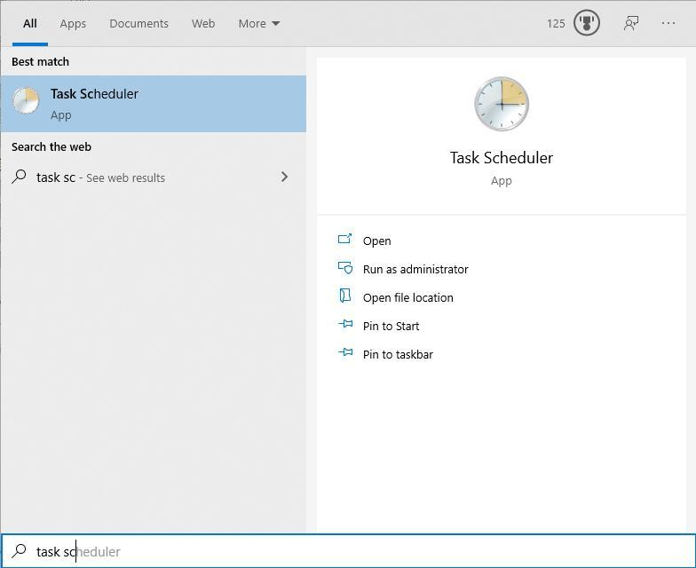
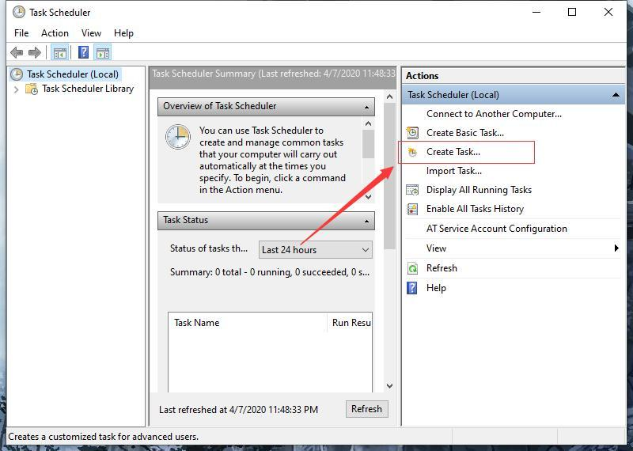
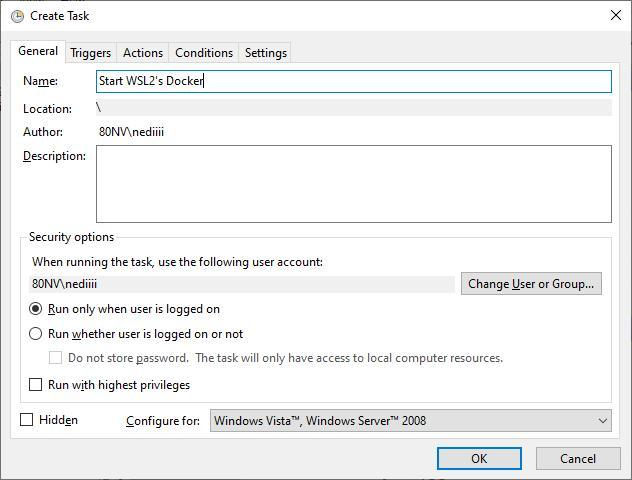
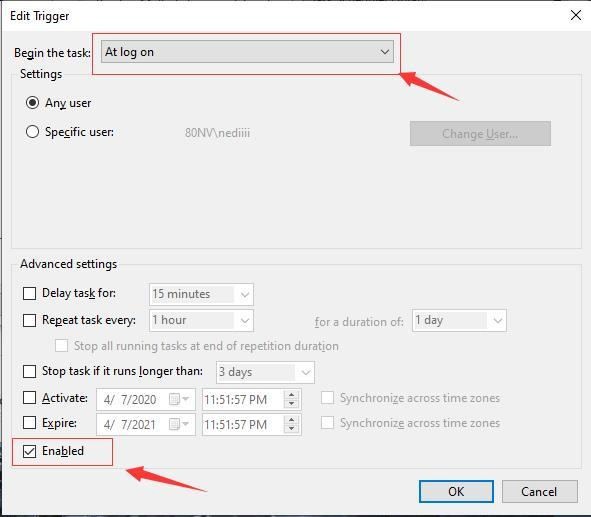
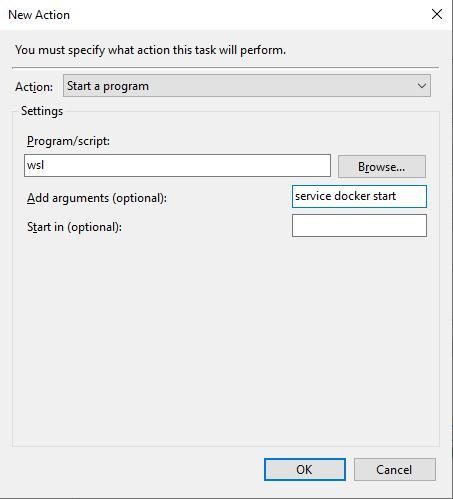
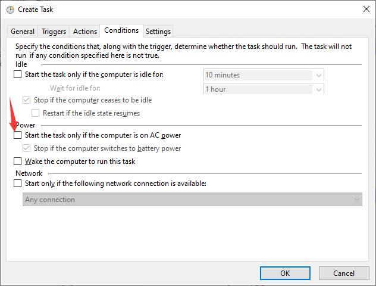

# Main Title

[^_^]: # (url:wsl2-note)
[^_^]: # (tag:wsl2,note)
[^_^]: # (excerpt:wsl2 里 docker 服务启动;wsl2 使用 Windows 代理)

> 笔者使用预览版镜像进行全新安装提前尝鲜了 Ver.2004(OS Build 19041.135).
> 奇怪的是并没有显示我的系统为预览版, 所以感兴趣的朋友可以尝试用镜像全新安装试试.
> 不知官方在何时正式释出 20H1 更新.

## WSL2 安装

见官方文档,不赘述. [https://docs.microsoft.com/en-us/windows/wsl/wsl2-install](https://docs.microsoft.com/en-us/windows/wsl/wsl2-install)

笔者熟悉 Ubuntu 的使用, WSL 也对 Ubuntu 有很好的支持. 全文皆以 Ubuntu18.04 为例说明.

为了简便, 有时使用 `WSL` 指代 `WSL2` .

## WSL 备份与恢复

    wsl --help # 查看帮助

1.  备份

        # wsl --export <Distro> <FileName>
        # 1. 查看Distro: wsl --list
        # 例如: wsl --export Ubuntu-18.04 D:\u.tar

2.  恢复

        # wsl --import <Distro> <InstallLocation> <FileName> [Options]

## WSL2 访问 Windows 的网络应用

参阅: [https://docs.microsoft.com/en-us/windows/wsl/wsl2-ux-changes#accessing-windows-applications-from-linux](https://docs.microsoft.com/en-us/windows/wsl/wsl2-ux-changes#accessing-windows-applications-from-linux)

WSL2 可以通过 `/etc/resolv.conf` 文件中的 nameserver 的值作为 IP 地址来访问 Windows 中的服务.

这一值是动态生成的, 每次重启后都可能不同, 所以需要使用脚本来动态获取.

在 `~/.bashrc` 中添加如下代码, 获取 nameserver 值 export 到环境变量 `HOST_IP` 中. 方便后续使用.

    export HOST_IP=$(grep -oP '(?<=nameserver\ ).*' /etc/resolv.conf)

可以顺便加入代理地址环境变量(请替换成你的 Windows 本地代理端口)

    export PORXY_ADDR="http://${HOST_IP}:1080"

有此地址便可方便地设置 `http_proxy` 等环境变量让 WSL 使用 Windows 下监听在 1080 端口的网络代理了(注意记得代理软件要开启允许局域网设备访问)

以下是笔者开关代理的脚本, 在终端使用 proxy / unproxy 命令即可 开启/关闭 代理 :

    # CUSTOM CONFIG
    export HOST_IP=$(grep -oP '(?<=nameserver\ ).*' /etc/resolv.conf)
    export PORXY_ADDR="http://$HOST_IP:1080"

    # GLOBAL PROXY FOR BASH

    # if ~/.bash_proxy not exist , then create it.
    if [ ! -f ~/.bash_proxy ]; then
        touch ~/.bash_proxy
    fi
    # execute ~/.bash_proxy
    . ~/.bash_proxy

    function proxy() {
        # export all_proxy="$PORXY_ADDR"
        # export http_proxy="$PORXY_ADDR"
        # export https_proxy="$PORXY_ADDR"
        # export ALL_PROXY="$PORXY_ADDR"
        # export HTTP_PROXY="$PORXY_ADDR"
        # export HTTPS_PROXY="$PORXY_ADDR"
        echo -e "export {all_proxy,http_proxy,https_proxy,ALL_PROXY,HTTP_PROXY,HTTPS_PROXY}=\"$PORXY_ADDR\";" | tee ~/.bash_proxy >/dev/null
        # apply
        . ~/.bash_proxy
        # declare
        echo "current proxy status: using $PORXY_ADDR, proxying"
    }

    function unproxy() {
        # unset all_proxy http_proxy https_proxy ALL_PROXY HTTP_PROXY HTTPS_PROXY
        echo -e "unset all_proxy http_proxy https_proxy ALL_PROXY HTTP_PROXY HTTPS_PROXY" | tee ~/.bash_proxy >/dev/null
        # apply
        . ~/.bash_proxy
        # declare
        echo "current proxy status:  direct connect, not proxying"
    }

## Git

在 WSL 下用 vscode 打开 git 项目, `git status` 会显示文件被修改(实际上没有), 这可能是因为 Linux 和 Windows 的不同换行符造成的.
在 WSL 下设置 `git config --global core.autocrlf true` 来忽略它即可解决.

    git config --global core.autocrlf true

## Docker 配置

安装 Docker. 不赘述. 依照 Docker 官方文档安装即可.

### 取消 service docker start 需要密码的机制

使用 service docker start 命令时, 需要使用 sudo 来执行. 而 sudo 需要输入密码. 阻碍了我们自动化开启 Docker.

下面使用 sudoers 文件配置使该命令不需要输入密码.

1.  创建 `/etc/sudoers.d/docker` 文件 (!注意文件不可包含符号 `.` 和符号 `~` ) 否则不会生效

        sudo vi /etc/sudoers.d/docker

2.  将以下内容写入 `/etc/sudoers.d/docker`

        # 用户($USER)在所有计算机(ALL)下可以使用root(root)的身份权限且不需要输入密码(NOPASSWD)来运行/usr/sbin/service(`which service`), 且限定参数为docker和一个任意参数(如:start,stop,status)
        echo "$USER ALL=(root)  NOPASSWD: `which service` docker *" | sudo tee /etc/sudoers.d/docker

3.  根据 sudoers 的推荐设置, 修改 `/etc/sudoers.d/docker` 的权限,

        sudo chmod 0440 /etc/sudoers.d/docker

### 配置 Docker 自启动

实现 WSL 下 Docker 自启动的方式有很多,下面介绍三种方式

1.  配置使用 systemd

    因为本身 WSL 没有使用 systemd 管理服务, 我也没有选择这种方式. 如需了解, 请参阅: [https://github.com/microsoft/WSL2-Linux-Kernel/issues/30](https://github.com/microsoft/WSL2-Linux-Kernel/issues/30)

2.  配置 `~/.bashrc` 或者 `/etc/profile` 等文件

    2.1 直接添加启动代码到 `.bashrc` 中, 每次启动终端都会运行一次, 比较多余.

        echo "sudo service docker start" | tee -a ~/.bashrc >/dev/null

    2.2 直接添加启动代码到 `/etc/profile` 中, 启动 WSL 时运行一次, 稍显合理.

        echo "sudo service docker start" | tee -a /etc/profile >/dev/null

    2.3 保持 `/etc/profle` 无污染,加启动代码加到 `/etc/profile.d/docker.sh`中. bash 会在读取 `/etc/profile` 时自动加载 `profile.d` 下面的文件

        # echo "service docker start" | tee -a ~/.bashrc >/dev/null
        sudo touch /etc/profile.d/docker-start.sh && \
        chmod 644 /etc/profile.d/docker-start.sh && \
        echo "sudo service docker start" | tee -a /etc/profile.d/docker-start.sh >/dev/null

    使用上面 3 种方式, 都可以使我们打开 WSL 时自动运行 Docker. 在开机之后, Docker 不会自动运行. 如果有服务依赖 Docker 的话, 我们仍需要手动打开 WSL. 建议使用下面介绍的方式.

3.  使用 Windows 的 `任务计划`

    使用 Windows 的任务计划, 实现 Windows 开机之后自动执行 WSL 并使用命令启动 Docker 守护程序. 这样开机之后 Docker 便自动运行. 我们不需要再操心开启 Docker.

    3.1 打开 `task scheduler`

    

    3.2 创建新`task`

    

    3.3 设置`Task`

    
    
    
    

### Docker Mirror and Proxy

    # 在/etc/default/docker中加入以下内容
    export http_proxy="$PROXY_ADDR"
    # 设置镜像
    sudo mkdir -p /etc/docker && echo -e '{\n  "registry-mirrors": ["https://docker.mirrors.sjtug.sjtu.edu.cn"]\n}' | sudo tee /etc/docker/daemon.json

## 附

笔者 WSL `~/.bashrc` 的脚本和配置

